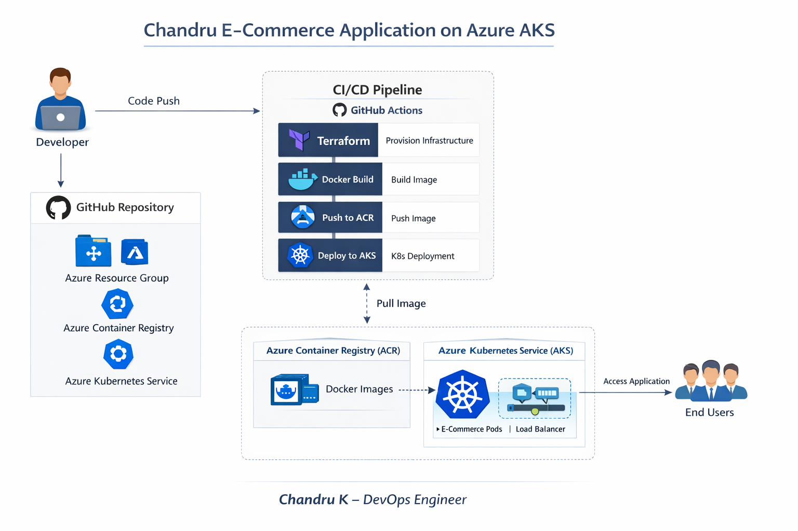

# Project Architecture

# 🚀 Chandru E-Commerce Application on Azure AKS

A production-style DevOps project demonstrating end-to-end cloud infrastructure provisioning, containerization, CI/CD automation, and Kubernetes deployment on Microsoft Azure.

This project is designed to reflect real-world DevOps workflows used in product-based companies.

---

## 🧠 Project Goal

The goal of this project is to:

- Provision Azure cloud infrastructure using Terraform
- Build and containerize an e-commerce backend application
- Deploy the application on Azure Kubernetes Service (AKS)
- Implement CI/CD automation using GitHub Actions
- Follow DevOps best practices such as Infrastructure-as-Code, automation, and scalability

This project demonstrates how a DevOps Engineer takes an application from:

**Code → Container → Cloud → Kubernetes → Production**

---

## 🏗️ High-Level Architecture

Developer
|
| Git Push
v
GitHub Repository
|
| CI/CD Trigger
v
GitHub Actions
|
|-- Terraform Apply
| ├── Azure Resource Group
| ├── Azure Kubernetes Service (AKS)
| └── Azure Container Registry (ACR)
|
|-- Docker Build
|-- Push Image to ACR
|
|-- kubectl apply
v
Azure Kubernetes Service (AKS)
|
|-- Kubernetes Deployment
|-- Kubernetes Service
v
E-Commerce Backend Application (Flask API)

---

## 🛠️ Tech Stack & Why It Was Chosen

| Technology | Purpose | Reason |
|----------|--------|--------|
| Python (Flask) | Backend API | Lightweight and ideal for microservices |
| Docker | Containerization | Consistent runtime across environments |
| Terraform | Infrastructure as Code | Declarative and repeatable provisioning |
| Azure Kubernetes Service (AKS) | Orchestration | Managed Kubernetes on Azure |
| Azure Container Registry (ACR) | Image Registry | Secure private container registry |
| GitHub Actions | CI/CD | Native GitHub automation |
| Kubernetes YAML | Deployment | Industry-standard orchestration |

---

## 📁 Repository Structure

├── app/ # Flask application
│ ├── app.py
│ ├── requirements.txt
│
├── docker/ # Docker configuration
│ └── Dockerfile
│
├── terraform/ # Infrastructure as Code
│ ├── main.tf
│ ├── variables.tf
│ ├── outputs.tf
│
├── k8s/ # Kubernetes manifests
│ ├── deployment.yaml
│ ├── service.yaml
│
├── .github/workflows/ # GitHub Actions CI/CD pipeline
│ └── deploy.yml
│
└── README.md

---

## 🚀 Step-by-Step Setup & Deployment

### 1️⃣ Prerequisites

- Azure Subscription
- Terraform >= 1.x
- Docker
- kubectl
- GitHub Account

---

### 2️⃣ Clone the Repository

git clone https://github.com/Chandruthelinesmasher/chandru-ecommerce-AKS.git

cd chandru-ecommerce-AKS

---

### 3️⃣ Provision Infrastructure Using Terraform

cd terraform
terraform init
terraform plan
terraform apply

This provisions:
- Azure Kubernetes Service (AKS)
- Azure Container Registry (ACR)
- Required networking resources

---

### 4️⃣ CI/CD Pipeline (GitHub Actions)

The CI/CD pipeline is fully automated and triggers on every push to the `main` branch.

on:
push:
branches:
- main

Pipeline stages:
1. Checkout source code
2. Authenticate to Azure
3. Provision infrastructure using Terraform
4. Build Docker image
5. Push image to Azure Container Registry
6. Deploy application to AKS using kubectl

No manual deployment is required.

---

### 5️⃣ Verify Kubernetes Deployment

kubectl get pods
kubectl get svc

Example output:

NAME READY STATUS AGE
ecommerce-app-xxxxx 1/1 Running 2m

---

## 🌐 Application Access

The application is exposed using a Kubernetes Service.

http://<EXTERNAL-IP>/api/products

(The external IP is assigned by the AKS LoadBalancer)

---

## 📌 Example Logs

kubectl logs deployment/ecommerce-app

Running on http://0.0.0.0:5000

---

## 💡 Key Learnings from This Project

- End-to-end CI/CD automation using GitHub Actions
- Terraform-based Azure infrastructure provisioning
- Kubernetes deployment and service exposure on AKS
- Container image lifecycle management
- Debugging and validating Kubernetes workloads

---

## 🎯 Why This Project Is Interview-Ready (12–15 LPA)

✔ Real Azure cloud implementation  
✔ Kubernetes (AKS) production workflow  
✔ Infrastructure-as-Code using Terraform  
✔ Automated CI/CD pipeline  
✔ Scalable and reproducible architecture  
✔ Easy to explain during interviews  

---

## 📌 Future Enhancements

- Helm charts for deployment
- Prometheus & Grafana monitoring
- Azure Key Vault for secrets
- Horizontal Pod Autoscaling (HPA)
- Ingress controller with TLS

---

## 👨‍💻 Author

**Chandru K**  
DevOps Engineer | Azure | Kubernetes | Terraform  
GitHub: https://github.com/Chandruthelinesmasher

